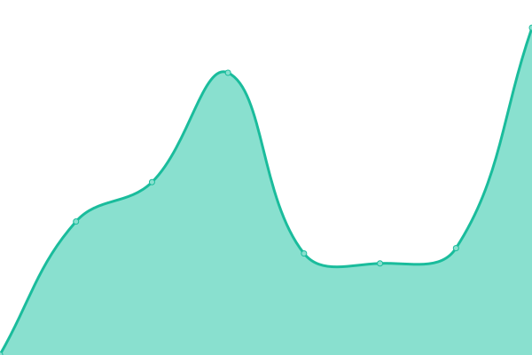
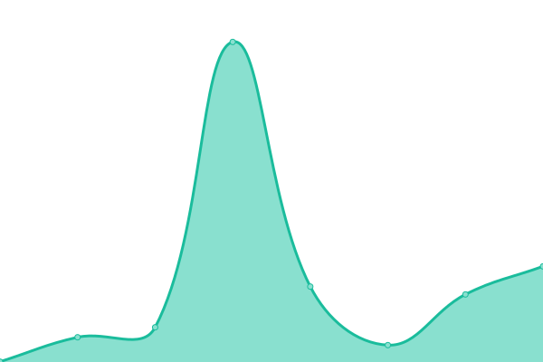

# [📈 Live Status](https://algers.github.io/zencity-status): <!--live status--> **🟩 All systems operational**

This repository contains the open-source uptime monitor and status page for [alger](https://algers.github.io/zencity-status), powered by [Upptime](https://github.com/upptime/upptime).

With [Upptime](https://upptime.js.org), you can get your own unlimited and free uptime monitor and status page, powered entirely by a GitHub repository. We use [Issues](https://github.com/algers/zencity-status/issues) as incident reports, [Actions](https://github.com/algers/zencity-status/actions) as uptime monitors, and [Pages](https://algers.github.io/zencity-status) for the status page.

<!--start: status pages-->
<!-- This summary is generated by Upptime (https://github.com/upptime/upptime) -->
<!-- Do not edit this manually, your changes will be overwritten -->
<!-- prettier-ignore -->
| URL | Status | History | Response Time | Uptime |
| --- | ------ | ------- | ------------- | ------ |
|  [livezencity](https://www.livezencity.com) | 🟩 Up | [livezencity.yml](https://github.com/algers/zencity-status/commits/HEAD/history/livezencity.yml) | 

 705ms
     
 | 

<a href="https://algers.github.io/zencity-status/history/livezencity">100.00%</a>
    

|  [portal](https://portal.zencity.tools) | 🟩 Up | [portal.yml](https://github.com/algers/zencity-status/commits/HEAD/history/portal.yml) | 

 209ms
     
 | 

<a href="https://algers.github.io/zencity-status/history/portal">100.00%</a>
    

|  [Superset](https://superset.zencity.tools) | 🟩 Up | [superset.yml](https://github.com/algers/zencity-status/commits/HEAD/history/superset.yml) | 

 460ms
     
 | 

<a href="https://algers.github.io/zencity-status/history/superset">99.06%</a>
    

|  [ValueProp](https://zencity.co) | 🟩 Up | [value-prop.yml](https://github.com/algers/zencity-status/commits/HEAD/history/value-prop.yml) | 

 112ms
     
 | 

<a href="https://algers.github.io/zencity-status/history/value-prop">100.00%</a>
    

<!--end: status pages-->

[**Visit our status website →**](https://algers.github.io/zencity-status)

## 📄 License

- Powered by: [Upptime](https://github.com/upptime/upptime)
- Code: [MIT](./LICENSE) © [alger](https://algers.github.io/zencity-status)
- Data in the `./history` directory: [Open Database License](https://opendatacommons.org/licenses/odbl/1-0/)
